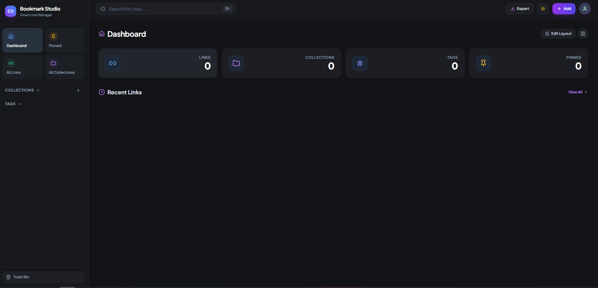

> 🤖 **Built with AI** — Engineered using Gemini 3.5 Flash & Antigravity AI Assistant

# 🔖 Bookmark Fireblaze

**Bookmark Fireblaze** is a modern, responsive, serverless web application for storing, organizing, and managing web links using custom folder icons, sub-group hierarchies, soft delete trash recovery, and full JSON database export.

Built with **Vite**, **React**, **TypeScript**, **Tailwind CSS**, **Shadcn UI**, **Firebase Auth & Firestore**, and **Backblaze B2 Cloud Object Storage**.



---

## 💡 Why This Project? (Motivation & Story)

> *"I struggled to manage my bookmarks for a long time. I always forgot where I saved links—whether in browser bookmark bars, social media saved items, or random chat messages. Having my own self-hosted bookmark management web app gives me complete freedom to organize links into custom folder hierarchies and sub-groups. Most importantly, I have 100% control over my data because everything is stored securely in my own Firebase and Backblaze B2 accounts with zero hosting fees!"*

---

## 🏗️ Architecture & Technology Rationale

### 1. Why Firebase? (Database & Authentication)
- **Zero Server Overhead**: Firebase provides serverless Authentication (Email/Password) and NoSQL Cloud Database (Firestore).
- **Free Tier Friendly**: Firebase offers generous free limits (50,000 document reads & 20,000 writes/day), making it 100% free for personal link management.
- **Easy Frontend Deployment**: Eliminates the need for a custom NodeJS or Python backend. The app is a static Single Page Application (SPA) deployable on **Vercel** or **Netlify** for free!

### 2. Why Backblaze B2? (Cloud Image Storage)
- **Free 10 GB Object Storage**: Backblaze B2 provides **10 GB of free cloud storage** with S3-compatible APIs.
- **Efficient Image Handling**: Perfect for storing bookmark thumbnail images and previews without cluttering database documents or incurring heavy storage fees.

---

## ✨ Features

- 📂 **Folders & Sub-groups**: Organize bookmarks into nested folder trees with custom SVG icons.
- 🎨 **Folder Icon Picker**: Interactive picker featuring custom SVG icons (`blue-mac-folder`, `purple-folder`, `red-mac-folder`, etc.).
- 🗑️ **Soft Delete & Trash Bin**: Deleting a link or folder moves it to the Trash Bin (`isDeleted: true`). Restore items anytime or permanently delete them with a confirmation popup modal.
- 📥 **JSON Database Export**: Export your entire bookmark database with 1-click into a structured JSON file including category paths (e.g. `Productivity / Study Guides`).
- 🔐 **Protected Routes & Auth**: Strict Email/Password authentication. Data is private and isolated per user (`userId` scoped).
- 📌 **Pin & Tags System**: Pin important links to top, assign multiple tags (`#productivity`, `#science`), and filter instantly.
- 🔍 **Real-time Search**: Search links by title, URL, description, or tags with `Ctrl+K` keyboard shortcut support.
- 🌙 **Sleek Dark Theme**: Glassmorphic dark theme styled with Tailwind CSS and Radix UI primitives.

---

## 🔑 How to Get Required Credentials

### Step 1: Firebase Setup (Auth & Firestore)
1. Go to the [Firebase Console](https://console.firebase.google.com/) and click **Add Project**.
2. Name your project **`bookmark-fireblaze`**.
3. In the sidebar, navigate to **Build > Authentication**:
   - Click **Get Started**.
   - Under Sign-in method, select **Email/Password** and click **Enable**.
4. In the sidebar, navigate to **Build > Firestore Database**:
   - Click **Create Database**.
   - Start in **Production Mode** or **Test Mode**.
5. Navigate to **Project Settings** (gear icon) > **General**:
   - Scroll down to *Your apps* and click the **Web icon (`</>`)**.
   - Register app name e.g. `bookmark-fireblaze-web`.
   - Copy your Firebase config object values (`apiKey`, `authDomain`, `projectId`, `storageBucket`, `messagingSenderId`, `appId`).

---

### 🛡️ Firestore Security Rules Setup (Fix Permission Error)

To prevent `FirebaseError: Missing or insufficient permissions`, configure your Firestore rules to allow authenticated users to manage their own documents:

1. In the Firebase Console sidebar, go to **Build > Firestore Database > Rules**.
2. Replace the rules with:

```javascript
rules_version = '2';

service cloud.firestore {
  match /databases/{database}/documents {
    
    // Allow users to manage their own groups
    match /groups/{groupId} {
      allow read, update, delete: if request.auth != null && request.auth.uid == resource.data.userId;
      allow create: if request.auth != null && request.auth.uid == request.resource.data.userId;
    }
    
    // Allow users to manage their own bookmarks
    match /bookmarks/{bookmarkId} {
      allow read, update, delete: if request.auth != null && request.auth.uid == resource.data.userId;
      allow create: if request.auth != null && request.auth.uid == request.resource.data.userId;
    }

  }
}
```

3. Click **Publish**.

---

### Step 2: Backblaze B2 Setup (Image Upload Storage)
1. Sign up for a free account at [Backblaze B2 Cloud Storage](https://www.backblaze.com/b2/cloud-storage.html).
2. In the B2 Cloud Storage Admin Console, click **Buckets > Create a Bucket**:
   - Name e.g. `bookmark-fireblaze-storage`.
   - Set Bucket Type to **Public**.
3. Go to **Application Keys > Add a New Application Key**:
   - Name your key e.g. `bookmark-key`.
   - Allow Access to Bucket: Select your created bucket.
   - Access Type: **Read and Write**.
   - Click **Create Application Key**.
4. Copy the generated keys:
   - `keyID` -> `VITE_B2_KEY_ID`
   - `applicationKey` -> `VITE_B2_APPLICATION_KEY`
   - `S3 Endpoint` (e.g. `s3.your-region.backblazeb2.com`) -> `VITE_B2_ENDPOINT`
   - `Region` (e.g. `your-region`) -> `VITE_B2_REGION`


---

## ⚙️ Environment Variables Configuration

Create a `.env` file in the root directory of the project:

```env
# =========================================
# FIREBASE CONFIGURATION (Auth & Firestore)
# =========================================
VITE_FIREBASE_API_KEY=your_firebase_api_key
VITE_FIREBASE_AUTH_DOMAIN=bookmark-fireblaze.firebaseapp.com
VITE_FIREBASE_PROJECT_ID=bookmark-fireblaze
VITE_FIREBASE_STORAGE_BUCKET=bookmark-fireblaze.firebasestorage.app
VITE_FIREBASE_MESSAGING_SENDER_ID=1234567890
VITE_FIREBASE_APP_ID=1:1234567890:web:abcdef123456

# =========================================
# BACKBLAZE B2 STORAGE CONFIGURATION
# =========================================
VITE_B2_KEY_ID=003xxxxxxxxxxxxxxx
VITE_B2_APPLICATION_KEY=K003xxxxxxxxxxxxxxxx
VITE_B2_ENDPOINT=s3.your-region.backblazeb2.com
VITE_B2_BUCKET_NAME=bookmark-fireblaze-storage
VITE_B2_REGION=your-region

# =========================================
# APP & ACCESS CONTROL (Optional)
# =========================================
# Set to 'true' to allow public user registration. Defaults to 'false' (Personal / Private Mode).
VITE_ENABLE_REGISTRATION=false
```

---

## 🔒 Access Control & Registration Toggle

By default, **public user registration is disabled in the UI**. Bookmark Studio is configured as a personal project for private deployment, meaning only existing accounts can log in and the "Create Account" registration tab is hidden on the login screen.

---

### 🛡️ Complete Backend Lockdown (Recommended for Personal / Private Use)

If you want to use the application exclusively for yourself (or create accounts for friends/family manually), you can lock down registration at the **backend API level**. 

To **100% guarantee** that nobody can create an account—even by manipulating browser DevTools, console scripts, Postman, or cURL requests:

1. Go to the [Firebase Console](https://console.firebase.google.com/).
2. Select your project -> **Authentication**.
3. Go to the **Settings** tab.
4. Click on **User actions**.
5. Uncheck **"Enable create (sign-up)"** (or toggle off user registration).
6. Click **Save**.

> 💡 **Tip for Friends & Family Access:** As the project administrator, you can manually create user accounts for yourself or friends anytime by going to **Firebase Console > Authentication > Users** and clicking **Add User**.

---

### 🌐 Enabling Public Registration (Public Mode)

If you wish to open the application to the public and allow visitors to create their own accounts from the webpage, re-enable registration in either of two easy ways:

#### Option 1: Environment Variable (Recommended for Netlify / Vercel)
Add `VITE_ENABLE_REGISTRATION=true` to your `.env` file or deployment environment settings:
```env
VITE_ENABLE_REGISTRATION=true
```

#### Option 2: Configuration File
In [src/config/authConfig.ts](file:///e:/MyProjects/Bookmark/src/config/authConfig.ts), change `ALLOW_REGISTRATION` to `true`:
```typescript
export const ALLOW_REGISTRATION = true;
```

*(Note: If you turned off sign-ups in Firebase Console, make sure to re-enable "Enable create (sign-up)" under Firebase Authentication Settings as well).*

---

## 🚀 Local Development Setup

1. **Clone Repository**:
   ```bash
   git clone https://github.com/your-username/bookmark-fireblaze.git
   cd bookmark-fireblaze
   ```

2. **Install Dependencies**:
   ```bash
   npm install
   ```

3. **Run Local Server**:
   ```bash
   npm run dev
   ```
   Open `http://localhost:3000` in your browser.

4. **Build Production Bundle**:
   ```bash
   npm run build
   ```

---

## 🌐 Free Deployment (Vercel / Netlify)

Because Bookmark Fireblaze is a pure frontend Single Page Application (SPA), it can be deployed for **100% free** on Vercel or Netlify.

### Deploying to Vercel:
1. Push project repository to GitHub.
2. Import project into [Vercel](https://vercel.com).
3. Set **Framework Preset** to `Vite`.
4. Copy environment variables from `.env` into Vercel's **Environment Variables** settings.
5. Click **Deploy**.

---

## 📜 License

Distributed under the MIT License. See `LICENSE` for details.
